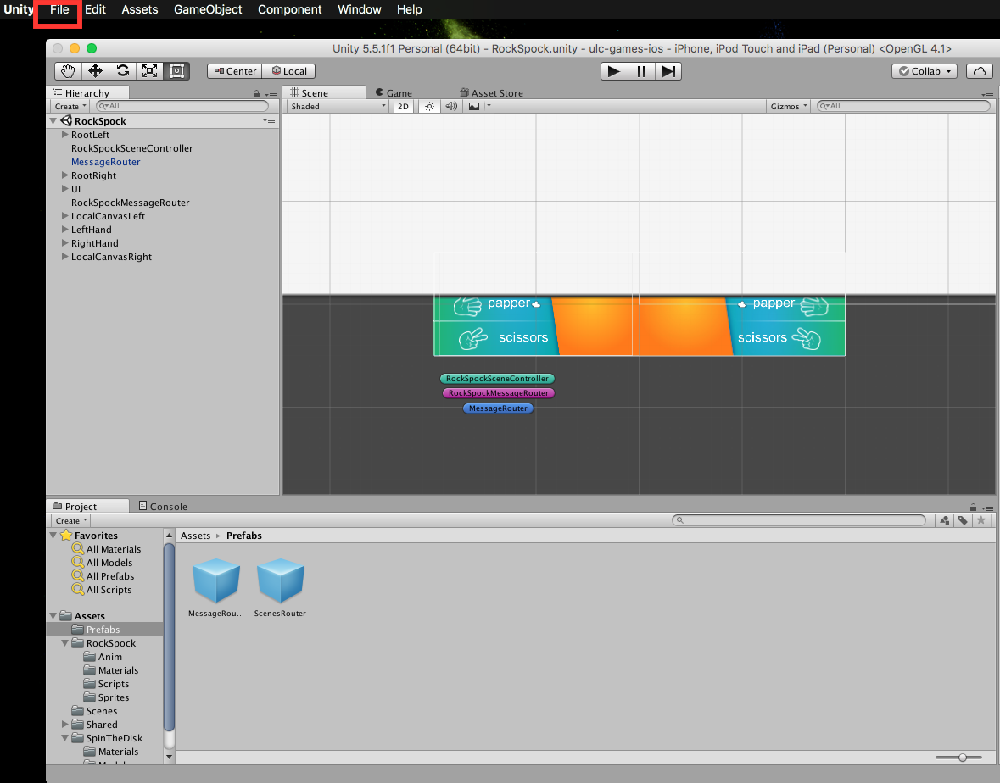
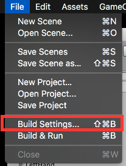
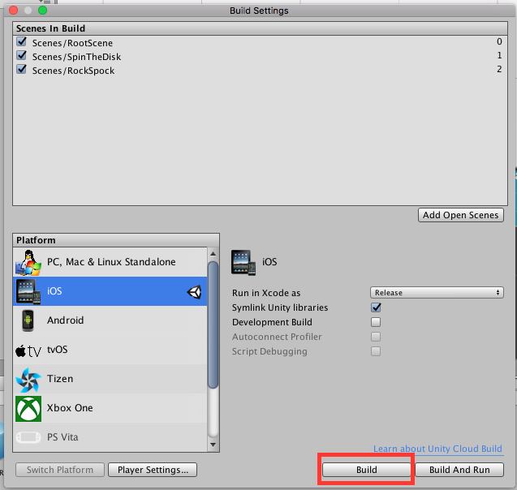
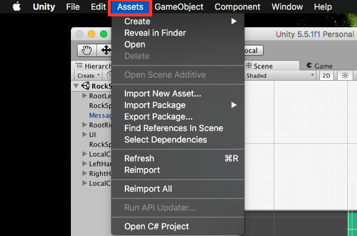
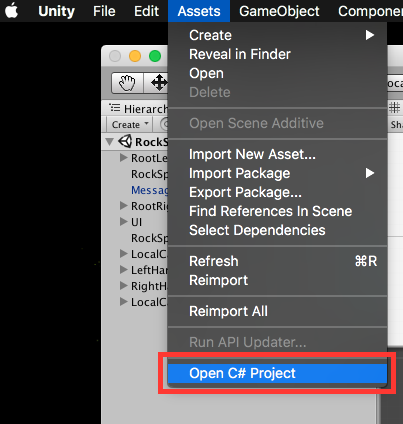
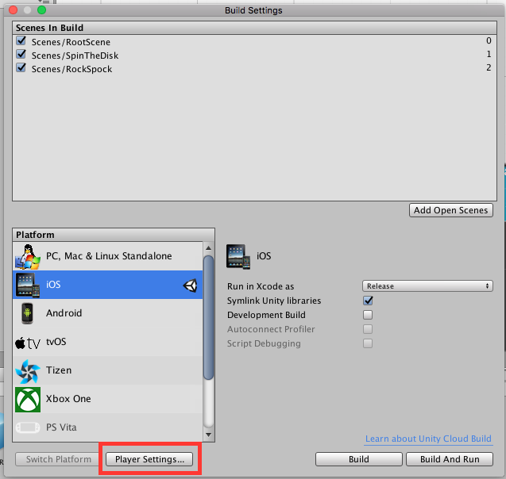
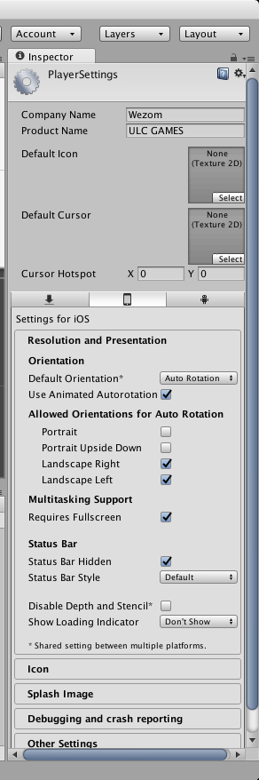
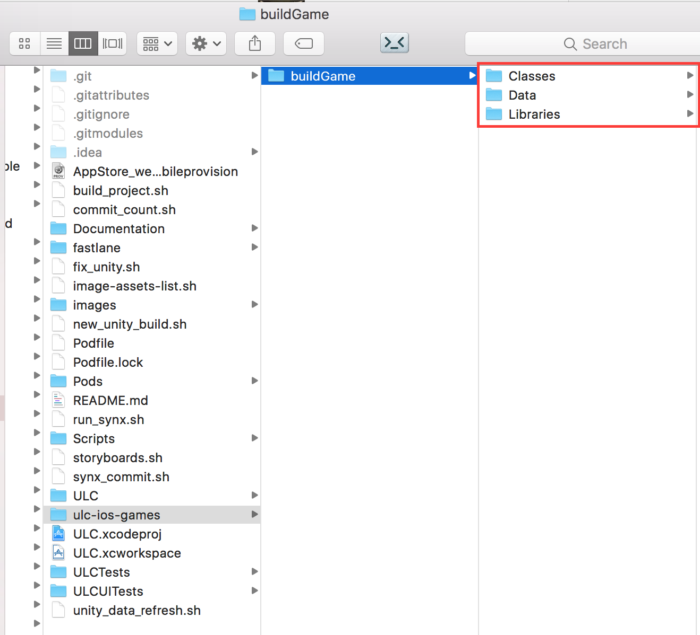
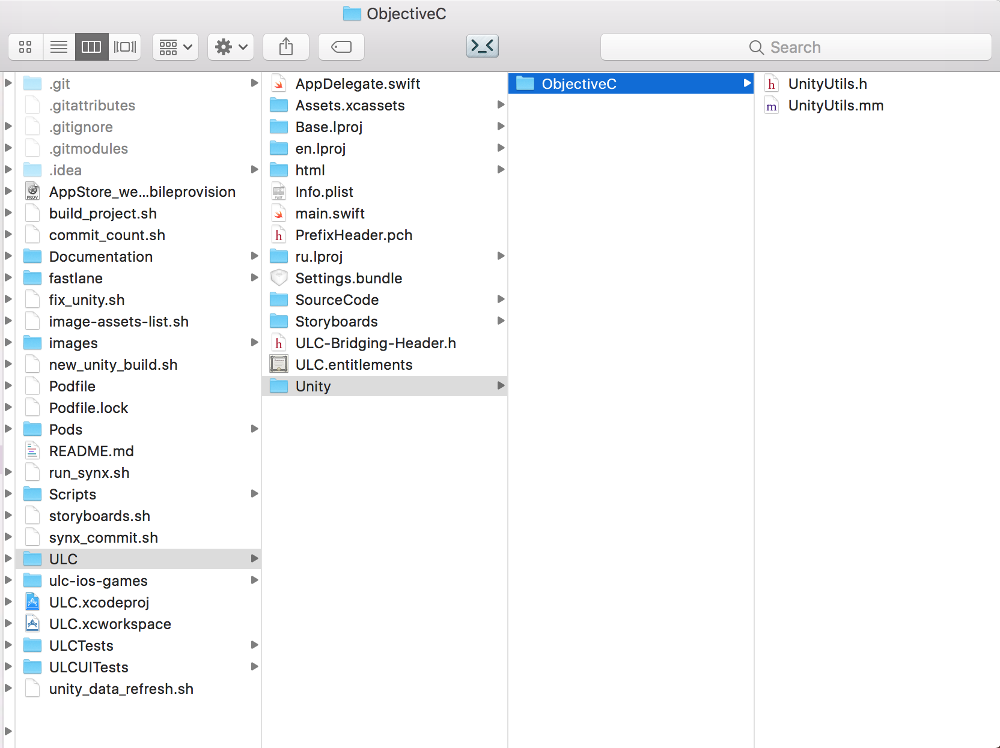
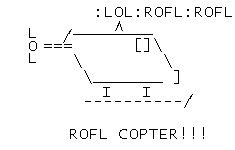

Unity iOS Documentation
========================================

👷 Developed by: [@adamluissean](https://github.com/AdamLuisSean) (Alexey Shtanko)
## Table of contents
* [Unity](#unity)
* [Xcode configuration](#xconfig)

Unity
==========
###Create new build: 
- `File -> Build Settings -> iOS -> Build`
 
<details>
  <summary>Screenshots</summary>
  
* 
 
* 
 
* 

</details>

### Open C# project (Editor: Mono Develop):
- `Assets -> Open C# Project` 

<details>
  <summary>Screenshots</summary>
  
* 

* 

</details>

### Player Settings:
- `File -> Build Settings -> Player Settings`

<details>
  <summary>Screenshots</summary>
  
  * 
   
  * 
  
  * 
  
  * 
</details>

### C# Project changes for iOS:
🚀 [Unity project repo](https://bitbucket.org/wezom/ulc-games-ios)

* Open unity repo and see commits
* Changes for iOS marked like: ``` /* iOS changes */  ```

### Scripts:
* Execute ``` run_synx.sh ``` for make synx safety (excluded unity files)
* Execute ``` synx_commit.sh ``` for commit and push to current branch
* Execute ``` new_unity_build.sh ``` for configure build automatically (optional)
* Execute ``` fix_unity.sh ``` for fix unity files (replace changed files)

> Notice: if you have problems with scripts try following command: ``` sudo chmod 755 <script_name.sh> ```

### For configure follow next article:
🚀 [How to use Unity 3D within an iOS app](https://github.com/blitzagency/ios-unity5) 

Xcode configuration
==========

### Project structure
###### Unity build files:
- `ProjectRoot/ulc-ios-games/buildGame`

<details>
  <summary>Screenshots</summary>
  
  * 
  
</details>

###### Unity configuration files:
- `ProjectRoot/ULC/Unity/ObjectiveC`

<details>
  <summary>Screenshots</summary>
  
  * 
  
</details>

### Issues

####  **Bitbucket is not supported ``` <details> ``` tag lol.**

